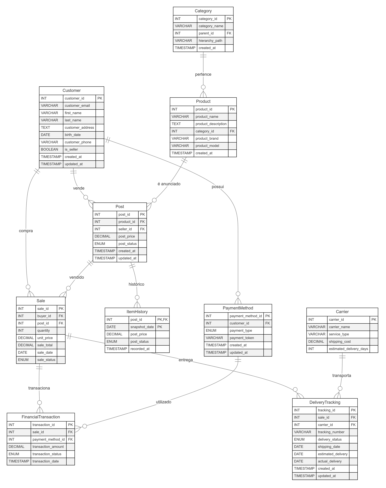
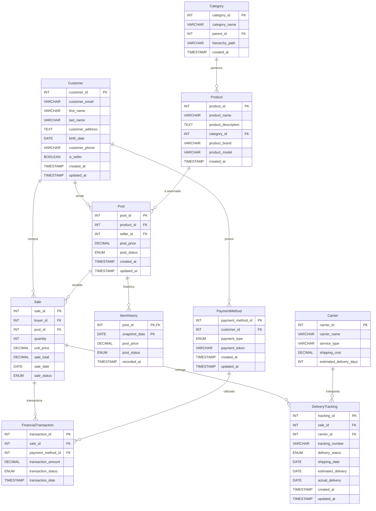

# Diagrama ER do Banco de Dados

## Código Mermaid para gerar o diagrama:

```mermaid

erDiagram

  Customer {
    INT customer_id PK
    VARCHAR customer_email
    VARCHAR first_name
    VARCHAR last_name
    TEXT customer_address
    DATE birth_date
    VARCHAR customer_phone
    BOOLEAN is_seller
    TIMESTAMP created_at
    TIMESTAMP updated_at
  }

  Category {
    INT category_id PK
    VARCHAR category_name
    INT parent_id FK
    VARCHAR hierarchy_path
    TIMESTAMP created_at
  }

  Product {
    INT product_id PK
    VARCHAR product_name
    TEXT product_description
    INT category_id FK
    VARCHAR product_brand
    VARCHAR product_model
    TIMESTAMP created_at
  }

  Post {
    INT post_id PK
    INT product_id FK
    INT seller_id FK
    DECIMAL post_price
    ENUM post_status
    TIMESTAMP created_at
    TIMESTAMP updated_at
  }

  Sale {
    INT sale_id PK
    INT buyer_id FK
    INT post_id FK
    INT quantity
    DECIMAL unit_price
    DECIMAL sale_total
    DATE sale_date
    ENUM sale_status
  }

  ItemHistory {
    INT post_id PK,FK
    DATE snapshot_date PK
    DECIMAL post_price
    ENUM post_status
    TIMESTAMP recorded_at
  }

  PaymentMethod {
    INT payment_method_id PK
    INT customer_id FK
    ENUM payment_type
    VARCHAR payment_token
    TIMESTAMP created_at
    TIMESTAMP updated_at
  }

  FinancialTransaction {
    INT transaction_id PK
    INT sale_id FK
    INT payment_method_id FK
    DECIMAL transaction_amount
    ENUM transaction_status
    TIMESTAMP transaction_date
  }

  Carrier {
    INT carrier_id PK
    VARCHAR carrier_name
    VARCHAR service_type
    DECIMAL shipping_cost
    INT estimated_delivery_days
  }

  DeliveryTracking {
    INT tracking_id PK
    INT sale_id FK
    INT carrier_id FK
    VARCHAR tracking_number
    ENUM delivery_status
    DATE shipping_date
    DATE estimated_delivery
    DATE actual_delivery
    TIMESTAMP created_at
    TIMESTAMP updated_at
  }

  Customer ||--o{ Post : "vende"
  Customer ||--o{ PaymentMethod : "possui"
  Customer ||--o{ Sale : "compra"
  Category ||--o{ Product : "pertence"
  Product ||--o{ Post : "é anunciado"
  Post ||--o{ Sale : "vendido"
  Post ||--o{ ItemHistory : "histórico"
  Sale ||--o{ FinancialTransaction : "transaciona"
  Sale ||--o{ DeliveryTracking : "entrega"
  PaymentMethod ||--o{ FinancialTransaction : "utilizado"
  Carrier ||--o{ DeliveryTracking : "transporta"
```

